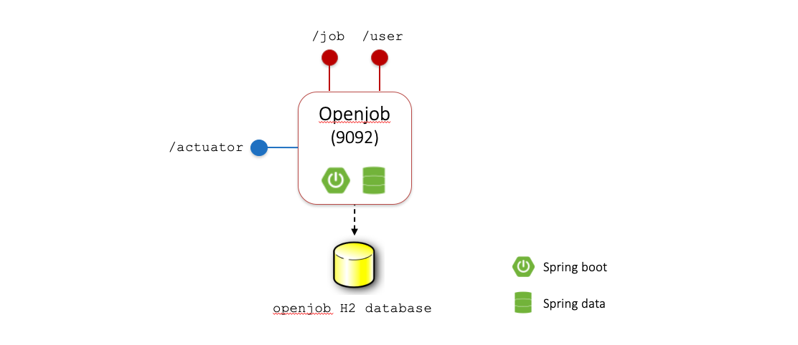

# Spring Boot Openjob system

Sample Spring Boot microservice application, developed with Spring Web, Spring Cloud, Spring Cloud Config, Spring Cloud Netflix Eureka, Spring Cloud OpenFeign, Spring Retry.

Openjob is a simple platform allowing people to publish or apply for job offers.

## Repository information
This repository has been set up for the Service Oriented Software Engineering course at University of L'Aquila for academic years 2022-2023 and 2023-2024.

It features both the monolithic and microservice version of the Openjob system and a [step-by-step guide](development/) from the two "simple" User and Job microservices to the final dockerized system. The source of the application in each development step is made available in the [development](development/) folder.

> [!NOTE]
> Spring Boot and Spring Cloud versions are not updated to their latest available releases. For compatibility reasons, this repository uses Spring Boot 3.1.11 (updated from 3.0.6) and Spring Cloud 2022.0.2.

### Repository structure
```
springboot-microservices-development
|   README.md               # This file
|   LICENSE                 # License file
|   .gitignore              # .gitignore file
|---docs                    # Documentation's images
|---monolithic-application 
|   └---openjob             # Monolithic openjob application
|---microservice-application
|   |---config-server       # Configuration server service implementation
|   |---discovery-server    # Discovery server service implementation
|   |---gateway             # System's API Gateway implementation
|   |---job                 # Job microservice implementation
|   |---user                # User microservice implementation
|   |---docker-compose.yml  # Docker compose file
|   └---pom.xml             # Maven's package root pom
└---development             # Folder containing the step-by-step guide for building the final application starting from the initial microservices
    |   README.md           # Development guide documentation
    |---docs                # Guide's images
    |---0-microservices     # Initial microservices (development step 0)
    └---...                 # Further development steps (1 to 5)
```

## Monolithic application

The Openjob monolithic application is found in `/monolithic-application/openjob/` folder. It is built with Spring Boot 3, Spring Data JPA and a H2 database (running in-memory).


### Download, installation and run

Download the repository

```
git clone https://github.com/gianlucafilippone/springboot-microservices-development.git
cd springboot-microservices-development/monolithic-application/openjob
```

The application can be installed and launched either on the local machine or on a Docker container.

#### Local machine deployment

To build and run the application locally, [Java JDK 17](https://www.oracle.com/java/technologies/javase/jdk17-archive-downloads.html) or later and [Apache Maven](https://maven.apache.org) are required.

Compile and run

```
mvn install
java -jar target/openjob-0.0.1-SNAPSHOT.jar 
```
or

```
mvn spring-boot:run
```

By default, a Tomcat server will be running at port 9092.

#### Dockerize application

Openjob comes with a Dockerfile allowing the application to run on [Docker](https://www.docker.com) containers.

```
docker build -t openjob .
docker run --name openjob -dp 9092:9092 openjob
```

### System architecture
<p align="center">
  
</p>


### Data Model
<p align="center">
  
</p>

### Exposed endpoints

- `/actuator`
    - `[GET] http://localhost:9092/actuator/health`
    - `[GET] http://localhost:9092/actuator/info`
- `/user`
    - `[GET, POST, PUT] http://localhost:9092/user`
    - `[GET, DELETE] http://localhost:9092/user/id/{id}`
    - `[GET] http://localhost:9092/user/username/{username}`
- `/job`
    - `[GET, POST, PUT] http://localhost:9092/job`
    - `[GET, DELETE] http://localhost:9092/job/{id}`
    - `[GET] http://localhost:9092/job/apply/{username}/{id}`

## Microservice application

The microservice version of Openjob is realized by decomposing the `openjob` monolith into two microservices: `user` and `job`. Those services are put alongise other services playing the role of service discovery (`discovery-service`), API gateway (`gateway`), and configuration server (`config-server`). The folder `microservice-application/` contains all those services. They can be deployed on Docker thanks to the provided `docker-compose` file.

| Service | Description | Folder | Default exposed port |Service URL|
|---------|-------------|--------|----------------------|-----------|
|User microservice|Manages the users of the system.|`user/`|9044|`/user`|
|Job microservice|Manages the creation, update, deletion of a job offer and the job application from users.|`job/`|9055|`/job`|
|API Gateway|API Gateway realized through Spring Cloud Gateway. Maps incoming requests to the exposed `/api/*` endpoint to the User and Job microservices, balancing their instances.|`/microservice-application/gateway`|9000|`/api/usr`, `/api/job`|
|Discovery service|Discovery server to allow microservices to register to the service registry. User, Job and Api Gateway are clients of the Discovery service to register themselves or getting the URLs of the available service instances to be invoked.|`discovery-server/`|8761|`/eureka`|
|Configuration server|Handles the configuration of the API Gateway and Job and User microservices. It is realized through Spring Cloud Config. The configuration files are stored into an external git repository ([`gianlucafilippone/openjob-properties-repository`](https://github.com/gianlucafilippone/openjob-properties-repository)). Configuration is loaded at the services startup.|`config-server/`|8888|`/api-gateway`, `/user-microservice`, `/job-microservice`|


### Download, installation and run

Download the repository

```
git clone https://github.com/gianlucafilippone/springboot-microservices-development.git
cd springboot-microservices-development/microservice-application/
```

#### Standalone deployment

This deployment requires [Java JDK 17](https://www.oracle.com/java/technologies/javase/jdk17-archive-downloads.html) or later, [Apache Maven](https://maven.apache.org), and a running [MYSQL server](https://dev.mysql.com/downloads/mysql/).

Compile the project (you can skip this command if running `mvn spring-boot:run` in the next steps):

```
mvn install
```

Run the configuration service:
```
mvn spring-boot:run -pl config-server
```

or 

```
java -jar config-server/target/config-server-0.0.1-SNAPSHOT.jar
```

Run the discovery server:
```
mvn spring-boot:run -pl discovery-server -Dspring-boot.run.arguments="--CONFIG_SERVER_HOST=localhost --CONFIG_SERVER_PORT=8888
```

or 

```
java -jar config-server/target/discovery-server-0.0.1-SNAPSHOT.jar --CONFIG_SERVER_HOST=localhost --CONFIG_SERVER_PORT=8888
```

Run the API Gateway:
```
mvn spring-boot:run -pl gateway -Dspring-boot.run.arguments="--CONFIG_SERVER_HOST=localhost --CONFIG_SERVER_PORT=8888 --EUREKA_SERVER=http://localhost:8761/eureka/"
```

or

```
java -jar gateway/target/gateway-0.0.1-SNAPSHOT.jar --CONFIG_SERVER_HOST=localhost --CONFIG_SERVER_PORT=8888 --EUREKA_SERVER=http://localhost:8761/eureka/

```

Run User and Job microservices:

(Substitute `{user/job}` with `user` or `job` to run the command. Execute the command for both microservices)

```
mvn spring-boot:run -pl {user/job} -Dspring-boot.run.arguments="--CONFIG_SERVER_HOST=localhost --CONFIG_SERVER_PORT=8888 --EUREKA_SERVER=http://localhost:8761/eureka/ --MYSQL_HOST=localhost:3306 --MYSQL_DB={user/job} --MYSQL_PORT=3306 --MYSQL_USER=root --MYSQL_PASSWORD=root"
```

or

```
java -jar {user/job}/target/{user/job}-0.0.1-SNAPSHOT.jar --CONFIG_SERVER_HOST=localhost --CONFIG_SERVER_PORT=8888 --EUREKA_SERVER=http://localhost:8761/eureka/ --MYSQL_HOST=localhost:3306 --MYSQL_DB={user/job} --MYSQL_PORT=3306 --MYSQL_USER=root --MYSQL_PASSWORD=root
```

Note: to run Job and User microservices a MYSQL server should be up and running. In this configuration, we assume that is running on the `localhost` at port `3306`. The database user and paassword are `root`.

#### Dockerize application

The microservice version of Openjob comes with a `docker-compose` file that allows deploying the whole system on Docker.

```
docker compose up
```

Alternatively, to run all the components without using Docker Compose:

```
docker network create openjob-network

docker pull mysql:latest
docker run -d --name openjob-mysql --network openjob-network -v openjob_mysql-data:/var/lib/mysql -e MYSQL_ROOT_PASSWORD=root mysql:latest

docker pull phpmyadmin:latest
docker run --name openjob-phpmyadmin -d --network openjob-network --link openjob-mysql:db -p 8081:80 phpmyadmin:latest

docker build -t config-server config-server/
docker run --name config-server --network openjob-network -dp 8888:8888 config-server

docker build -t discovery-server discovery-server/
docker run --name discovery-server --network openjob-network -dp 8761:8761 -e CONFIG_SERVER_HOST=config-server -e CONFIG_SERVER_PORT=8888 discovery-server

docker build -t gateway gateway/
docker run --name gateway --network openjob-network -dp 9000:9000 -e CONFIG_SERVER_HOST=config-server -e CONFIG_SERVER_PORT=8888 -e EUREKA_SERVER=http://discovery-server:8761/eureka/ gateway

docker build -t user-microservice user/
docker run --name user-microservice --network openjob-network -dp 9044:9044 -e CONFIG_SERVER_HOST=config-server -e CONFIG_SERVER_PORT=8888 -e EUREKA_SERVER=http://discovery-server:8761/eureka/ -e MYSQL_HOST=openjob-mysql:3306 -e MYSQL_DB=user -e MYSQL_PORT=3306 -e MYSQL_USER=root -e MYSQL_PASSWORD=root user-microservice

docker build -t job-microservice job/
docker run --name job-microservice --network openjob-network -dp 9055:9055 -e CONFIG_SERVER_HOST=config-server -e CONFIG_SERVER_PORT=8888 -e EUREKA_SERVER=http://discovery-server:8761/eureka/ -e MYSQL_HOST=openjob-mysql:3306 -e MYSQL_DB=job -e MYSQL_PORT=3306 -e MYSQL_USER=root -e MYSQL_PASSWORD=root job-microservice
```

### System architecture
<p align="center">
  
</p>

### Data Model
<p align="center">
  
</p>

### Exposed Endpoints

#### By the API Gateway

These endpoints should be exposed for usage from client applications:

- `[GET, POST, PUT] http://localhost:9000/api/usr`
- `[GET, DELETE] http://localhost:9000/api/usr/id/{id}`
- `[GET] http://localhost:9000/api/usr/username/{username}`
- `[GET, POST, PUT] http://localhost:9000/api/job`
- `[GET, DELETE] http://localhost:9000/api/job/{id}`
- `[GET] http://localhost:9000/api/job/apply/{username}/{id}`
- `[GET] http://localhost:9000/actuator/health`
- `[GET] http://localhost:9000/actuator/info`
- `[GET] http://localhost:9000/actuator/refresh`

#### By User and Job microservices

These endpoints should not be exposed outside the application and used only by microservices and the API Gateway

- User microservice
    - `[GET, POST, PUT] http://localhost:9044/user`
    - `[GET, DELETE] http://localhost:9044/user/id/{id}`
    - `[GET] http://localhost:9044/user/username/{username}`
    - `[GET] http://localhost:9044/actuator/health`
    - `[GET] http://localhost:9044/actuator/info`
    - `[POST] http://localhost:9044/actuator/refresh`
- Job microservice
    - `[GET, POST, PUT] http://localhost:9055/job`
    - `[GET, DELETE] http://localhost:9055/job/{id}`
    - `[GET] http://localhost:9055/job/apply/{username}/{id}`
    - `[GET] http://localhost:9055/actuator/health`
    - `[GET] http://localhost:9055/actuator/info`
    - `[POST] http://localhost:9055/actuator/refresh`

## Thanks

Thanks to Alexander for the legacy material of the Openjob application.

