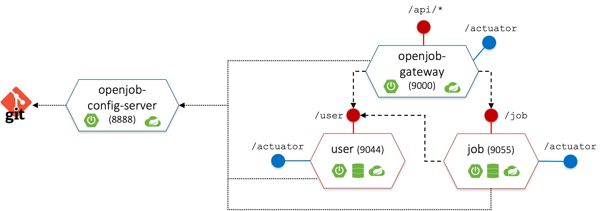
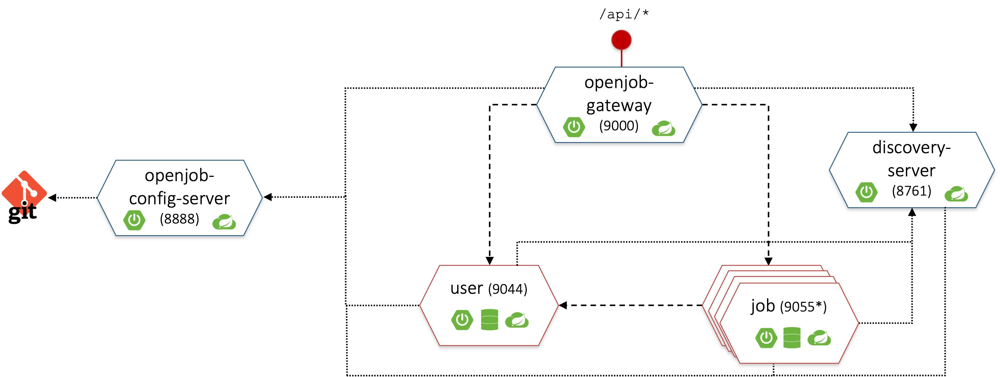
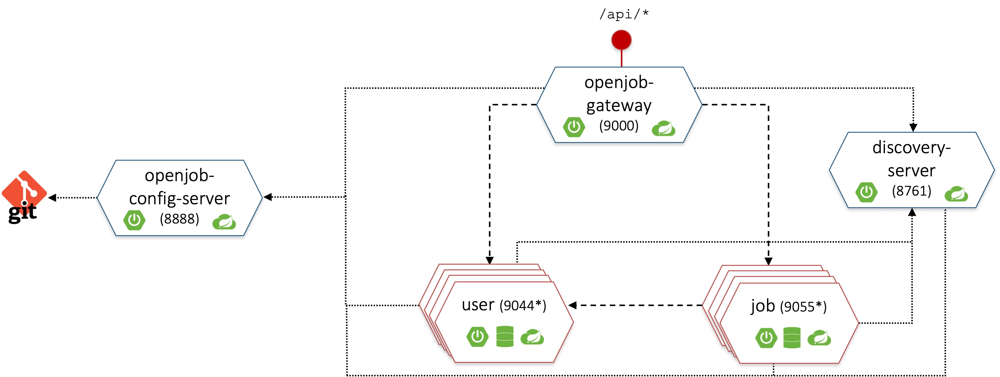
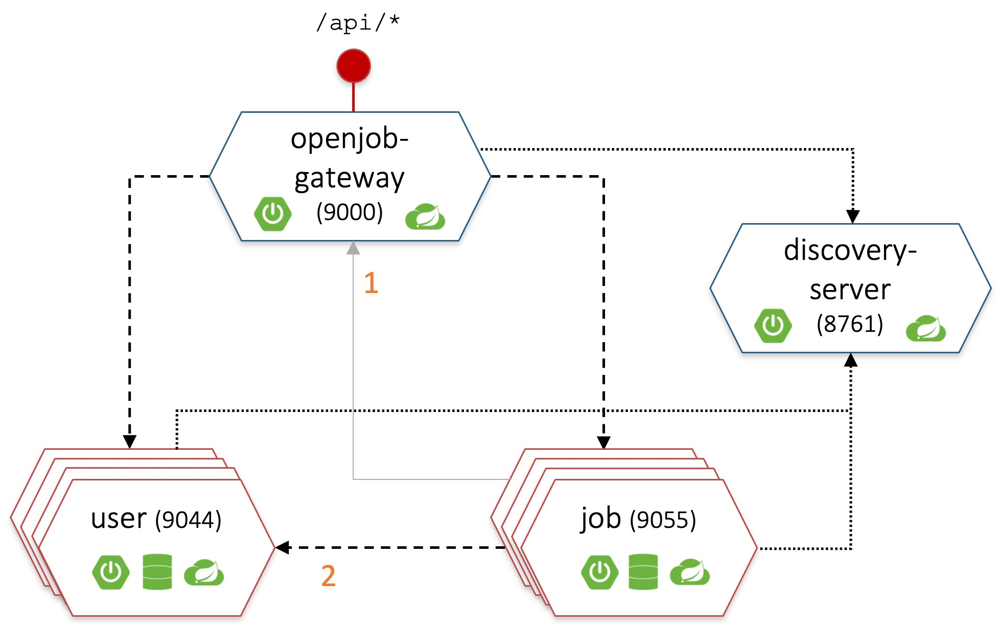

# Step by step development guide
In this section of the repository there is a step-by-step development process showing all the stages of the application development, from the simple microservices to the final dockerized app with decentralized configuration, service discovery and load balancing.

## Table of contents
0. [User and Job microservices](#step-0-user-and-job-microservices)
1. [Add API Gateway and mavenize application](#step-1-add-api-gateway-and-mavenize-application)
2. [Decentralize configuration](#step-2-decentralize-configuration)
3. [Service discovery and Load Balancing](#step-3-service-discovery-and-load-balancing)
4. [Client-side load balancing with OpenFeign](#step-4-client-side-load-balancing-with-openfeign)
5. [Dockerize application](#step-5-dockerize-application)

## Step 0: User and Job microservices
User and Job microservices from step zero are the base services that are extended in the next steps up to reach the final architecture of the microservice-based system.

They can be found in folders ```0-microservices/user``` and ```0-microservices/job```

### System architecture
<p align="center">
  
</p>

### Data Model
<p align="center">
  
</p>

### Deploy and run step 0 microservices

#### User microservice
Download the repository and access the User microservice folder:

```
git clone https://github.com/gianlucafilippone/springboot-microservices-development.git
cd springboot-microservices-development/development/0-microservices/user
```

Compile and run:
```
mvn install
java -jar target/user-0.0.1-SNAPSHOT.jar  
```
or
```
mvn spring-boot:run
```

#### Job microservice
Open a new terminal and access the `0-microservices/job/` folder, then compile and run the Job microservice:
```
mvn install
java -jar target/job-0.0.1-SNAPSHOT.jar  
```
or
```
mvn spring-boot:run
```

> [!NOTE]
> To avoid compiling each system component one by one, from step 1 on there will be a root `pom.xml` file to compile everything together.
> Deployment and run of the next steps is therefore easier.

### Exposed endpoints
- User microservice
    - `[GET, POST, PUT] http://localhost:9044/user`
    - `[GET, DELETE] http://localhost:9044/user/id/{id}`
    - `[GET] http://localhost:9044/user/username/{username}`
    - `[GET] http://localhost:9044/actuator/health`
    - `[GET] http://localhost:9044/actuator/info`
- Job microservice
    - `[GET, POST, PUT] http://localhost:9055/job`
    - `[GET, DELETE] http://localhost:9055/job/{id}`
    - `[GET] http://localhost:9055/job/apply/{username}/{id}`
    - `[GET] http://localhost:9055/actuator/health`
    - `[GET] http://localhost:9055/actuator/info`

## Step 1: Add API Gateway and mavenize application

### System architecture
<p align="center">
  
</p>

### Add an API Gateway
#### Create a new Spring Boot maven project
Create a new Java Maven project. The easiest way is by using the [Spring Initializer](https://start.spring.io): select `Gateway` and `Actuator` as dependencies.

> [!IMPORTANT]
> Check the Spring Boot version if using Spring Initializer: this guide requires Spring Boot 3.1.11 and Spring Cloud 2022.0.2.
> As of May 18, 2024, the support for Spring Boot 3.1.11 ended and Spring Initializer no longer allows the selection of versions previous to 3.2.6.
> Update the pom.xml as below to keep the example working:
> - Set Spring version to 3.1.1 and spring cloud version to 2022.0.2;
> - Add `spring-cloud-starter-gateway` and `spring-cloud-starter-actuator` dependencies;
> - Add the dependency management for Spring Cloud.

The `pom.xml` of the new Gateway project should look like this:

```xml
<?xml version="1.0" encoding="UTF-8"?>
<project xmlns="http://maven.apache.org/POM/4.0.0" xmlns:xsi="http://www.w3.org/2001/XMLSchema-instance"
	xsi:schemaLocation="http://maven.apache.org/POM/4.0.0 https://maven.apache.org/xsd/maven-4.0.0.xsd">
	<modelVersion>4.0.0</modelVersion>
	<parent>
		<groupId>org.springframework.boot</groupId>
		<artifactId>spring-boot-starter-parent</artifactId>
		<version>3.1.11</version>
		<relativePath/>
	</parent>
	<groupId>it.disim.univaq.sose.examples.openjob</groupId>
	<artifactId>gateway</artifactId>
	<version>0.0.1-SNAPSHOT</version>
	<name>gateway</name>
	<description>Openjob API gateway</description>
	<properties>
		<java.version>17</java.version>
		<spring-cloud.version>2022.0.2</spring-cloud.version>
	</properties>
	<dependencies>
		<dependency>
			<groupId>org.springframework.cloud</groupId>
			<artifactId>spring-cloud-starter-gateway</artifactId>
		</dependency>

		<dependency>
			<groupId>
				org.springframework.boot</groupId>
			<artifactId>spring-boot-starter-actuator</artifactId>
		</dependency>

	</dependencies>
	<dependencyManagement>
		<dependencies>
			<dependency>
				<groupId>org.springframework.cloud</groupId>
				<artifactId>spring-cloud-dependencies</artifactId>
				<version>${spring-cloud.version}</version>
				<type>pom</type>
				<scope>import</scope>
			</dependency>
		</dependencies>
	</dependencyManagement>

	<build>
		<plugins>
			<plugin>
				<groupId>org.springframework.boot</groupId>
				<artifactId>spring-boot-maven-plugin</artifactId>
			</plugin>
		</plugins>
	</build>

</project>
```

#### Configure the gateway
Create an `application.yaml` file into the `resource` folder (remove the default generated `application.properties`).

Add the configuration for:
- Server port;
- Gateway routes;
- Actuator.

The resulting `application.yaml` should look like this:

```yaml
# Port of the gateway
server:
  port: 9000
  
# Gateway configuration
spring:
  cloud:
    gateway:
      routes:
        - id: user_route
          uri: http://localhost:9044
          predicates:
          - Path=/api/usr/**
          filters:
          - RewritePath=/api/usr(?<segment>), /user$\{segment}
        - id: job_route
          uri: http://localhost:9055
          predicates:
          - Path=/api/job/**
          filters:
          - RewritePath=/api(?<segment>/?), $\{segment}

# Spring Boot Actuator configuration
management:
  endpoints:
    web:
      exposure:
        include: health,info

# Application info
info:
  application:
    name: Api Gateway
    description: Openjob Api Gateway
    version: 0.0.1-SNAPSHOT
```

#### Exposed endpoints
- `http://localhost:9000/api/usr` routed towards `http://localhost:9044/user`
- `http://localhost:9000/api/job` routed towards `http://localhost:9055/job`
- `[GET] http://localhost:9000/actuator/health`
- `[GET] http://localhost:9000/actuator/info`

### Mavenize application
Add a new `pom.xml` file to the root folder of the project to declare application's modules:

```xml
<?xml version="1.0" encoding="UTF-8"?>
<project xmlns="http://maven.apache.org/POM/4.0.0"
	xmlns:xsi="http://www.w3.org/2001/XMLSchema-instance"
	xsi:schemaLocation="http://maven.apache.org/POM/4.0.0 https://maven.apache.org/xsd/maven-4.0.0.xsd">
	<modelVersion>4.0.0</modelVersion>

	<groupId>it.disim.univaq.sose.examples</groupId>
	<artifactId>openjob</artifactId>
	<version>0.0.1-SNAPSHOT</version>
	<name>openjob</name>
	<packaging>pom</packaging>

	<modules>
		<module>gateway</module>
		<module>job</module>
		<module>user</module>
	</modules>
</project>
```

### Deploy and run step 1 application

> [!NOTE]
> This deployment steps are valid for every development stage hereon.

Download the repository and access this developent step subfolder

```
git clone https://github.com/gianlucafilippone/springboot-microservices-development.git
cd springboot-microservices-development/development/1-gateway+maven
```

Compile all the services:
```
mvn install
```

Run:
```
mvn spring-boot:run -pl [user/job/gateway]
```

## Step 2: Decentralize configuration

### System architecture
<p align="center">
  
</p>

### Create a property files repository
Initialize a new git repository
```
git init openjob-properties-repository
```

Move and rename the configuration files of the services inside the properties repository folder
```
user/src/main/resources/application.properties --> user-microservice-dev.properties
job/src/main/resources/application.properties --> job-microservice-dev.properties
gateway/src/main/resources/application.yml --> api-gateway-dev.yaml
```

Commit to add the file in the repository
```
git add .
git commit -m 'Adding properties files'
```

> [!NOTE]
> The property files repository is available [here](https://github.com/gianlucafilippone/openjob-properties-repository)

### Add a Configuration Server
#### Create a new Spring Boot Maven project
Create a new Java Maven project. The easiest way is by using the [Spring Initializer](https://start.spring.io): select `Config Server` and `Actuator` as dependencies.

> [!IMPORTANT]
> As for the previous step, mind the Spring Boot and Spring Cloud versions: `Spring Boot 3.1.11` and `Spring Cloud 2022.0.2`.

Resulting `pom.xml`:

```xml
<?xml version="1.0" encoding="UTF-8"?>
<project xmlns="http://maven.apache.org/POM/4.0.0" xmlns:xsi="http://www.w3.org/2001/XMLSchema-instance"
	xsi:schemaLocation="http://maven.apache.org/POM/4.0.0 https://maven.apache.org/xsd/maven-4.0.0.xsd">
	<modelVersion>4.0.0</modelVersion>
	<parent>
		<groupId>org.springframework.boot</groupId>
		<artifactId>spring-boot-starter-parent</artifactId>
		<version>3.1.1</version>
		<relativePath/> <!-- lookup parent from repository -->
	</parent>
	<groupId>it.disim.univaq.sose.examples</groupId>
	<artifactId>config-server</artifactId>
	<version>0.0.1-SNAPSHOT</version>
	<name>config-server</name>
	<description>User microservice</description>
	<properties>
		<java.version>17</java.version>
		<spring-cloud.version>2022.0.2</spring-cloud.version>
	</properties>
	<dependencies>
		<dependency>
			<groupId>org.springframework.boot</groupId>
			<artifactId>spring-boot-starter-actuator</artifactId>
		</dependency>
		<dependency>
			<groupId>org.springframework.cloud</groupId>
			<artifactId>spring-cloud-config-server</artifactId>
		</dependency>

		<dependency>
			<groupId>org.springframework.boot</groupId>
			<artifactId>spring-boot-starter-test</artifactId>
			<scope>test</scope>
		</dependency>
	</dependencies>
	<dependencyManagement>
		<dependencies>
			<dependency>
				<groupId>org.springframework.cloud</groupId>
				<artifactId>spring-cloud-dependencies</artifactId>
				<version>${spring-cloud.version}</version>
				<type>pom</type>
				<scope>import</scope>
			</dependency>
		</dependencies>
	</dependencyManagement>

	<build>
		<plugins>
			<plugin>
				<groupId>org.springframework.boot</groupId>
				<artifactId>spring-boot-maven-plugin</artifactId>
			</plugin>
		</plugins>
	</build>

</project>
```

#### Configure the Configuration Server
Edit the `application.properties` file:

```properties
# Port of the service
server.port=8888

# Actuator configuration
management.endpoints.web.exposure.include=health,info
management.info.env.enabled=true

# Application info (to be exposed by /info actuator)
info.application.name=Openjob config server
info.application.description=A server used by microservices for retreiving their configuration
info.application.version=0.0.1-SNAPSHOT

spring.cloud.config.server.git.uri=<PATH-TO-YOUR-GIT-REPOSITORY>
spring.cloud.config.server.git.default-label=master
```

> [!NOTE]
> The `spring.cloud.config.server.git.uri` property must point to the local or remote path of the `openjob-properties-repository`.
> Set the right uri before running the application!

Add the `@EnableConfigServer` annotation to the application class. The class should look like this:
``` java
@EnableConfigServer
@SpringBootApplication
public class ConfigServerApplication {

	public static void main(String[] args) {
		SpringApplication.run(ConfigServerApplication.class, args);
	}
}
```

#### Add a new module to the maven project
Update the project's root `pom.xml` to add the configuration server as one of the modules.
```xml
	<modules>
		<module>config-server</module>
		<module>gateway</module>
		<module>job</module>
		<module>user</module>
	</modules>
```

#### Exposed endpoints
- `[GET] http://localhost:8888/user-microservice/dev`
- `[GET] http://localhost:8888/job-microservice/dev`
- `[GET] http://localhost:8888/api-gateway/dev`


### Update User, Job and Gateway services
> [!NOTE]
> This steps are the same for each of the three components.

#### Add dependencies for Spring Cloud Config Client
Update the `pom.xml` by adding the dependency management for Spring Cloud and the dependency to `spring-cloud-config-client`:

```xml
	...
	<properties>
		<java.version>17</java.version>
		<spring-cloud.version>2022.0.2</spring-cloud.version>
	</properties>
	
	<dependencyManagement>
		<dependencies>
			<dependency>
				<groupId>org.springframework.cloud</groupId>
				<artifactId>spring-cloud-dependencies</artifactId>
				<version>${spring-cloud.version}</version>
				<type>pom</type>
				<scope>import</scope>
			</dependency>
		</dependencies>
	</dependencyManagement>
	
	<dependencies>
		...
		<dependency>
			<groupId>org.springframework.cloud</groupId>
			<artifactId>spring-cloud-starter-config</artifactId>
		</dependency>
		...
	</dependencies>
```

> [!NOTE]
> The Gateway's `pom.xml` already has the dependency mangament for Spring Cloud.

#### Update property files
Remove the old `application.properties` or `application.yaml` file and subsitute with a new `application.properties` as follows:
```properties
spring.application.name=[job-microservice/user-microservice/api-gateway]
spring.profiles.active=dev
spring.config.import=optional:configserver:http://localhost:8888
``` 

> [!IMPORTANT]
> The `spring.application.name` and `spring.profiles.active` properties must match with the name of the property file we put in the property files repository.
> E.g., the name `job-microservice` and the active profile `dev` must match with the property file `job-microservice-dev.properties` file.

Now, when starting one of these three components, its configuration will be asked to the configuration server.

> [!NOTE]
> The configuration server should be up and running before starting the services.

### Configure dynamic properties refresh
Update the services' properties (from the configuration files within the property files repository) and add `refresh` to the `management.endpoints.web.exposure.include` property.

The property file should contain these lines:
```properties
# Actuator configuration
management.endpoints.web.exposure.include=health,info,refresh
management.info.env.enabled=true
```

For the gateway, there should be this:
```yaml
management:
  endpoints:
    web:
      exposure:
        include: health,info,refresh
```

Add the `@RefreshScope` annotation to each Bean reading properties from the configuration file, e.g., the `UserMicroserviceInvoker` class.

```java
@Component
@RefreshScope
public class UserMicroserviceInvoker {
	...

	@Value("${microservice.user.find.uri}")
	private String baseUri;
	...
}
```

> [!NOTE]
> Always commit changes into the property files repository to make them available to the configuration server.

#### Test the dynamic reconfiguration
1. Update the `server.port` property in the `user-microservice-dev.properties` file to a different port (e.g., `9045`)
2. Commit changes and start all the services
3. Test the endpoints `[GET] http://localhost:9000/api/usr` and `[GET] http://localhost:9000/api/job/apply/applicant/2`: an error from both the Api Gateway and Job microservice occurs.
4. Update the job microservice property `microservice.user.find.uri` and the api gateway route configuration with the new user microservice port
5. Commit changes
6. Without restarting services, send an empty `POST` request to both `http://localhost:9055/actuator/refresh` (i.e., job microservice actuator refresh endpoint) and `http://localhost:9000/actuator/refresh` (i.e., gateway actuator refresh endpoint). The services will automatically update their configuration.
7. Run again step 3.


## Step 3: Service discovery and Load Balancing

### System architecture
<p align="center">
  
</p>

### Add a discovery server
#### Create a new Spring Boot Maven project
Create a new Java Maven project. The easiest way is by using the [Spring Initializer](https://start.spring.io): select `Eureka Server`, `Config`, and `Actuator` as dependencies.

> [!IMPORTANT]
> As for the previous step, mind the Spring Boot and Spring Cloud versions: `Spring Boot 3.1.11` and `Spring Cloud 2022.0.2`.

Resulting `pom.xml`:

```xml
<?xml version="1.0" encoding="UTF-8"?>
<project xmlns="http://maven.apache.org/POM/4.0.0" xmlns:xsi="http://www.w3.org/2001/XMLSchema-instance"
	xsi:schemaLocation="http://maven.apache.org/POM/4.0.0 https://maven.apache.org/xsd/maven-4.0.0.xsd">
	<modelVersion>4.0.0</modelVersion>
	<parent>
		<groupId>org.springframework.boot</groupId>
		<artifactId>spring-boot-starter-parent</artifactId>
		<version>3.1.11</version>
		<relativePath/> <!-- lookup parent from repository -->
	</parent>
	<groupId>it.disim.univaq.sose.examples.openjob</groupId>
	<artifactId>discovery-server</artifactId>
	<version>0.0.1-SNAPSHOT</version>
	<name>discovery-server</name>
	<description>Openjob Discovery Server</description>
	<properties>
		<java.version>17</java.version>
		<spring-cloud.version>2022.0.2</spring-cloud.version>
	</properties>
	<dependencies>
		<dependency>
			<groupId>org.springframework.boot</groupId>
			<artifactId>spring-boot-starter-actuator</artifactId>
		</dependency>
		<dependency>
			<groupId>org.springframework.cloud</groupId>
			<artifactId>spring-cloud-starter-config</artifactId>
		</dependency>
		<dependency>
			<groupId>org.springframework.cloud</groupId>
			<artifactId>spring-cloud-starter-netflix-eureka-server</artifactId>
		</dependency>

		<dependency>
			<groupId>org.springframework.boot</groupId>
			<artifactId>spring-boot-starter-test</artifactId>
			<scope>test</scope>
		</dependency>
	</dependencies>
	<dependencyManagement>
		<dependencies>
			<dependency>
				<groupId>org.springframework.cloud</groupId>
				<artifactId>spring-cloud-dependencies</artifactId>
				<version>${spring-cloud.version}</version>
				<type>pom</type>
				<scope>import</scope>
			</dependency>
		</dependencies>
	</dependencyManagement>

	<build>
		<plugins>
			<plugin>
				<groupId>org.springframework.boot</groupId>
				<artifactId>spring-boot-maven-plugin</artifactId>
			</plugin>
		</plugins>
	</build>

</project>
```

#### Configure the Discovery Server
Update the `application.properties` files:
```properties
spring.application.name=discovery-server
spring.profiles.active=dev
spring.config.import=optional:configserver:http://localhost:8888
```

Add the `@EnableEurekaServer` annotation to the application class. The class should look like this:
``` java
@EnableEurekaServer
@SpringBootApplication
public class DiscoveryServerApplication {

	public static void main(String[] args) {
		SpringApplication.run(DiscoveryServerApplication.class, args);
	}
}
```

Create a new `discovery-server-dev.yaml` file inside the property files repository:

```yaml
server:
  port: 8761

eureka:
  instance:
    hostname: localhost
  client:
    registerWithEureka: false
    fetchRegistry: false
    serviceUrl:
      defaultZone: http://${eureka.instance.hostname}:${server.port}/eureka/

management:
  endpoints:
    web:
      exposure:
        include: health,info

info:
  application:
    name: Discovery Server
    description: Openjob Discovery Server
    version: 0.0.1-SNAPSHOT
```

#### Add a new module to the maven project
Update the project's root `pom.xml` to add the discovery server as one of the modules.

```xml
...
	<modules>
		<module>config-server</module>
		<module>discovery-server</module>
		<module>gateway</module>
		<module>job</module>
		<module>user</module>
	</modules>
...
```

### Update User, Job and Gateway services
> [!NOTE]
> This steps are the same for each of the three components.

Update the `pom.xml` to add the dependency for `spring-cloud-starter-netflix-eureka-client`:

```xml
	...
	<dependency>
		<groupId>org.springframework.cloud</groupId>
		<artifactId>spring-cloud-starter-netflix-eureka-client</artifactId>
	</dependency>
	...
```

Add the `@EnableDiscoveryClient` annotation to the Application class. The class should look like this:

```java
@EnableJpaAuditing
@EnableDiscoveryClient
@SpringBootApplication
public class UserApplication {

	public static void main(String[] args) {
		SpringApplication.run(UserApplication.class, args);
	}
}
```

...or this:

```java
@EnableDiscoveryClient
@SpringBootApplication
public class GatewayApplication {

	public static void main(String[] args) {
		SpringApplication.run(GatewayApplication.class, args);
	}
}
```

### Update property files
Update `user-microservice-dev.properties` and `job-microservice-dev.properties` files within the property files repository by adding the configuration for registering to the Eureka Server. Add the following:

```properties
eureka.client.register-with-eureka=true
eureka.client.healthcheck.enabled=true
eureka.client.service-url.default-zone=http://localhost:8761/eureka/
eureka.instance.lease-renewal-interval-in-seconds=30
```

Also update the `api-gateway-dev.yaml` file:

```yaml
eureka:
  client:
    registerWithEureka: true
    healthcheck:
      enabled: true
    serviceUrl:
      defaultZone: http://localhost:8761/eureka/
  instance:
    lease-renewal-interval-in-seconds: 30
```

### Load balance the Job microservice
Update the Api Gateway's configuration to load balance the requests towards the Job microservice. Change `uri` for `job_route` from `http://localhost:9055` to `lb://job-microservice`. The gateway configuration should look like this:

```yaml
spring:
  cloud:
    gateway:
      routes:
        - id: user_route
          uri: http://localhost:9044
          predicates:
          - Path=/api/usr/**
          filters:
          - RewritePath=/api/usr(?<segment>), /user$\{segment}
        - id: job_route
          uri: lb://job-microservice
          predicates:
          - Path=/api/job/**
          filters:
          - RewritePath=/api(?<segment>/?), $\{segment}
```

### Run and test
1. Run all the system components and check the Eureka dashboard at `http://localhost:8761/eureka`.

> [!IMPORTANT]
> Remember to run the configuration server first, then the discovery server, and finally the User, Job, and Gateway services.

2. Run more instances of the Job microservice from command line with `mvn spring-boot:run -pl job-microservice -Dspring-boot.run.arguments="--server.port=<PORT_NUMBER>` (use, e.g., 9066 as `PORT_NUMBER`)

3. Check the new registered instances in the Eureka dashboard

> [!NOTE]
> By running multiple instances of the Job service, at this stage there will be inconsistency issues due to the in-memory DB used by each instance. These issues will be solved at Step 5.

## Step 4: Client-side load balancing with OpenFeign
Create an OpenFeign client to invoke the User microservice from within the Job microservice. This client will substitute the `UserMicroserviceInvoker` class used by the Job microservice to get the users details from their username. The OpenFeign client interacts with the Eureka server to get the User microservice instances and then it invokes one of them.

### System architecture
<p align="center">
  
</p>

### Update Job microservice

#### Add and configure Spring Cloud OpenFeign
Update the `pom.xml` of the Job microservice to add the dependency for `spring-cloud-starter-openfeign`:

```xml
	...
	<dependency>
		<groupId>org.springframework.cloud</groupId>
		<artifactId>spring-cloud-starter-openfeign</artifactId>
	</dependency>
	...
```

Add the `@EnableFeignClients` annotation to the Application class:

```java
@EnableJpaAuditing
@EnableDiscoveryClient
@EnableFeignClients
@SpringBootApplication
public class JobApplication {

	public static void main(String[] args) {
		SpringApplication.run(JobApplication.class, args);
	}
}
```

#### Create a dynamic Feign client
Create a new package (e.g., `it.disim.univaq.sose.examples.openjob.feign`) and a new interface (e.g., `UserMicroserviceFeignClient`) with the `@FeignClient` annotation.
Set `"user-microservice"` as `name` argument of the `@FeignClient` annotation to enable the Eureka service discovery.

```java
@FeignClient(name="user-microservice")
public interface UserMicroserviceFeignClient {

}
```

Add a new method (e.g., `findUserByUsername`) within the interface and annotate it with the `@GetMapping` annotation. Set the path of the endopoint of the user microservice to be invoked, i.e., `user/username/{username}` as argument of the annotation. Set `JsonNode` as method type and bind the path variable in the method parameters:

```java
@FeignClient(name="user-microservice")
public interface UserMicroserviceFeignClient {

	@GetMapping("/user/username/{username}")
	public JsonNode findUserByUsername(@PathVariable String username);
}
```

#### Update the @Autowired type
Update the `@Autowired private UserMicroserviceInvoker userMicroserviceInvoker;` definition into the `JobController` class by changing the type from `userMicroserviceInvoker` to `UserMicroserviceFeignClient`:

```java
@RestController
@RequestMapping("/job")
public class JobController {
	...
	@Autowired
	private UserMicroserviceFeignClient userMicroserviceInvoker;
	...
}
```

### Update the Api Gateway
To support the multiple instances of the User microservice, load balancing needs to be enabled also from the Api Gateway.
Update the `api-gateway-dev.yaml` file within the property files repository to support load balancing as done in the previous step.

```yaml
spring:
  cloud:
    gateway:
      routes:
        - id: user_route
          uri: lb://user-microservice
          predicates:
          - Path=/api/usr/**
          filters:
          - RewritePath=/api/usr(?<segment>), /user$\{segment}
        - id: job_route
          uri: lb://job-microservice
          predicates:
          - Path=/api/job/**
          filters:
          - RewritePath=/api(?<segment>/?), $\{segment}
```

> [!NOTE]
> User microservice instances could be balanced by only using the Api Gateway load balancer, by routing the requests from Job to User through the load balancing.
> This can be done by just updating the `microservice.user.find.uri` property within the `job-microservice-dev.properties` file to `http://localhost:9000/api/usr/username/`.
>
><p align="center">
>  
></p>
>
> In this way the Api Gateway will act as a fully-centralized load balancer (alternative 1 in the picture), while the Job microservice will not own its client-side load balancer.

### Run and Test
Run all the system components and call the `http://localhost:9000/api/job/apply/job/2` to check if the invocation from Job to User is performed.

> [!NOTE]
> The OpenFeign client can be used also without load balancing. To realize it, add a `url` argument in the `@FeignClient` annotation and set it to the base url of the service to be invoked, e.g., `http://localhost:9044/`, or by referencing a property, e.g., `${microservice.user.base.uri}`.
>
> ```java
>@FeignClient(name="userMicroserviceFeignClient", url="${microservice.user.base.uri}")
>public interface UserMicroserviceFeignClient {
>
>	@GetMapping("username/{username}")
>	public JsonNode findUserByUsername(@PathVariable String username);
>}
> ``` 
> Where the `microservice.user.base.uri` is set either to `http://localhost:9044/user/` (if the invocation from Job to User is direct) or to `http://localhost:9000/api/usr/` (if the invocation from Job to User is done through the Api Gateway as in the previous note).

## Step 5: Dockerize application

### Migrate to a MySQL DB
> [!NOTE]
> To properly run the application in a production-like environment, we have to move the User and Job databases to an external database.

#### Update User and Job microservices
> [!NOTE]
> This steps are the same for both microservices

Update the `pom.xml` file of the microservice by removing the dependency for `h2` and adding the one for `mysql-connector-j`.

```xml
...
<dependency>
	<groupId>com.mysql</groupId>
	<artifactId>mysql-connector-j</artifactId>
	<scope>runtime</scope>
</dependency>
...
```

Update the `data.sql` file by substituting the double quotes (`"`) with backtics (`` ` ``).

#### Update configuration files
Remove the previous `spring.datasource` and `spring.jpa` configurations from within `user-microservice-dev.properties` and `job-microservice-dev.properties` files from within the property files repository and replace with the new configuration for the MySQL database

```properties
spring.datasource.url=jdbc:mysql://localhost:8889/user_db?useSSL=false&allowPublicKeyRetrieval=true&serverTimezone=UTC&useLegacyDatetimeCode=false&createDatabaseIfNotExist=true
spring.datasource.username=root
spring.datasource.password=root
spring.datasource.driver-class-name=com.mysql.cj.jdbc.Driver

# Spring JPA configuration
spring.jpa.properties.hibernate.globally_quoted_identifiers=true
spring.jpa.hibernate.ddl-auto=update
```

> [!NOTE]
> In this configuration, we are assuming that the MySQL is running on the `localhost` with port `8889`.
> Set the name of the database for the two services (`user_db` and `job_db`). The previous code is related to the User microservice.

#### Run and test
Run the MySQL server and all the application components to test the application.

> [!NOTE]
> The database and its schema will be automatically create on the application startup. However, the data will not be loaded anymore.
> To load data, run the sql queries contained in the microservices' `data.sql` files on the respective database (e.g., through the Php MyAdmin console).
>
> As alternative, you may add the properties `spring.sql.init.mode=always` and `spring.jpa.defer-datasource-initialization=true` to the properties file (this is discouraged).

> [!IMPORTANT]
>
> Setting `spring.sql.init.mode=always` and `spring.jpa.defer-datasource-initialization=true` will cause the service crash when it is started up again. Remove the properties once the database is populated.

### Parametrize configurations
Remove all the hard-coded references to service urls (e.g., Configuration server, Eureka server) and database parameters (e.g., DB host and names, username, password) from the all the property files (both in the property files repository and in the service properties). Replace it with placeholders.

The `application.properties` file within the `/resources` folder of each system component should look like this:

```properties
spring.application.name=user-microservice

spring.profiles.active=dev

spring.config.import=optional:configserver:http://${CONFIG_SERVER_HOST}:${CONFIG_SERVER_PORT}
spring.cloud.config.fail-fast=true
```

> [!NOTE]
> There is no need to parametrize the Configuration service's `application.properties`. Set a remote repository as the URI of the property files. 

Update also the references in the property files repository.
Substitute the Eureka's default zone with `${EUREKA_SERVER}`, the mySQL host url with `${MYSQL_HOST}`, the database name with `${MYSQL_DB}`, and user and password with `${MYSQL_USER}` and `${MYSQL_PASSWORD}`.

The file `user-microservice-dev.properties` will look like this:

```properties
spring.datasource.url=jdbc:mysql://${MYSQL_HOST}/${MYSQL_DB}?useSSL=false&allowPublicKeyRetrieval=true&serverTimezone=UTC&useLegacyDatetimeCode=false&createDatabaseIfNotExist=true
spring.datasource.username=${MYSQL_USER}
spring.datasource.password=${MYSQL_PASSWORD}

...

eureka.client.service-url.defaultZone=${EUREKA_SERVER}
```

### Create the Dockerfiles
Create a `Dockerfile` for each of the system components: User and Job microservices, API Gateway, Discovery Server, Configuration Server.

The `Dockerfile` for the User microservice will look like this:

```
FROM maven:3.9.2-eclipse-temurin-17-alpine

WORKDIR /user-microservice
COPY  . .

RUN mvn clean install
CMD mvn spring-boot:run
```

> [!NOTE]
> The Dockerfile of each system component will look like the previous one. Only the `WORKDIR` path is different.
>
> Use `/job-microservice`, `/gateway-app`, `/discovery-server-app`, `/config-server-app` for the Job microservice, API Gateway, Discovery Server and Configuration Server, respectively.


### Create the docker-compose file
Create a `docker-compose.yml` in the root folder of the whole application (`/openjob`)

```yaml
services:
  openjob-mysql:
    image: mysql:latest
    volumes:
      - mysql-data:/var/lib/mysql
    environment:
      MYSQL_ROOT_PASSWORD: root

  openjob-phpmyadmin:
    image: phpmyadmin:latest
    ports:
      - "8081:80"
    links:
      - "openjob-mysql:db"
    depends_on:
      - openjob-mysql

  config-server:
    build: ./config-server
    ports:
      - "8888:8888"

  discovery-server:
    build: ./discovery-server
    ports:
      - "8761:8761"
	environment:
	  CONFIG_SERVER_HOST: config-server
      CONFIG_SERVER_PORT: 8888
    depends_on:
      - config-server

  gateway:
    build: ./gateway
    ports:
      - "9000:9000"
    environment:
      CONFIG_SERVER_HOST: config-server
      CONFIG_SERVER_PORT: 8888
      EUREKA_SERVER: http://discovery-server:8761/eureka/
    depends_on:
      - config-server
      - discovery-server

  user-microservice:
    build: ./user
    ports:
      - "9044-9049:9044"
    environment:
      CONFIG_SERVER_HOST: config-server
      CONFIG_SERVER_PORT: 8888
      EUREKA_SERVER: http://discovery-server:8761/eureka/
      MYSQL_HOST: openjob-mysql:3306
      MYSQL_DB: user
      MYSQL_USER: root
      MYSQL_PASSWORD: root
    depends_on:
      - config-server
      - discovery-server
      - openjob-mysql

  job-microservice:
    build: ./job
    expose:
      - "9055"
    environment:
      CONFIG_SERVER_HOST: config-server
      CONFIG_SERVER_PORT: 8888
      EUREKA_SERVER: http://discovery-server:8761/eureka/
      MYSQL_HOST: openjob-mysql:3306
      MYSQL_DB: job
      MYSQL_USER: root
      MYSQL_PASSWORD: root
    depends_on:
      - config-server
      - discovery-server
      - openjob-mysql
volumes:
  mysql-data: 
```

### Configure Spring Config Client Retry
> [!NOTE]
>
> The `depends_on` property in the `docker-compose` file ensures that containers are started in sequence, but it does not ensure that services are ready before starting the next one.
> The [Config Client Retry](https://cloud.spring.io/spring-cloud-config/multi/multi__spring_cloud_config_client.html#config-client-retry) needs to be configured to avoid the problem.

Add the property `spring.cloud.config.fail-fast=true` to the `application.properties` file of User and Job microservices, API Gateway, and Discovery Server to enable the retry getting configuration after a failure.

Add `spring-retry` and `spring-boot-starter-aop` to the `pom.xml` of the same components.

```xml
...
<dependency>
	<groupId>org.springframework.retry</groupId>
	<artifactId>spring-retry</artifactId>
</dependency>
<dependency>
	<groupId>org.springframework.boot</groupId>
	<artifactId>spring-boot-starter-aop</artifactId>
</dependency>
...
```

### Run the application
Run `docker-compose -p openjob up -d` to run the whole system. As an alternative, all components can be run without docker-compose as shown in the [repository description](../README.md#dockerize-application-1).

> [!NOTE]
> Files resulting from this final development step are in the [microservice-application](../microservice-application/) folder.