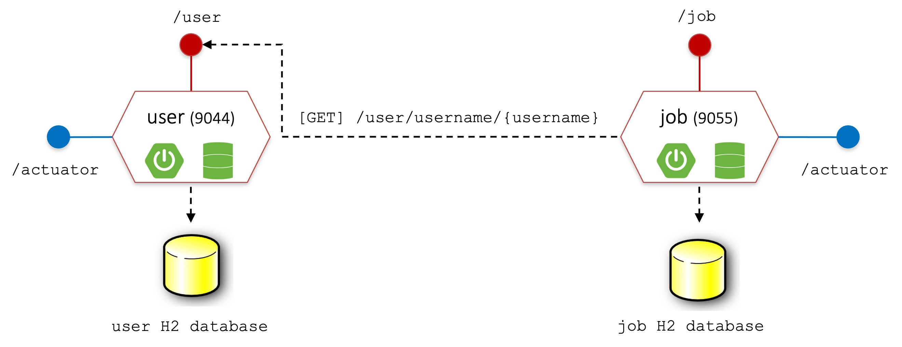

# Step by step development guide
In this section of the repository there is a step-by-step development process showing all the stages of the application development, from the simple microservices to the final dockerized app with decentralized configuration, service discovery and load balancing.

## Table of contents
0. [User and Job microservices](#step-0-user-and-job-microservices)
1. [Add API Gateway and mavenize application](#step-1-add-api-gateway-and-mavenize-application)
2. [Decentralize configuration](#step-2-decentralize-configuration)
3. [Service discovery and Load Balancing](#step-3-service-discovery-and-load-balancing)
4. [Client-side load balancing with OpenFeign](#step-4-client-side-load-balancing-with-openfeign)
5. [Dockerize application](#step-5-dockerize-application)

## Step 0: User and Job microservices
User and Job microservices from step zero are the base services that are extended in the next steps up to reach the final architecture of the microservice-based system.

They can be found in folders ```0-microservices/user``` and ```0-microservices/job```

### System architecture
<p align="center">
  
</p>

### Data Model
<p align="center">
  
</p>

### Deploy and run step 0 microservices

#### User microservice
Download the repository and access the User microservice folder:

```
git clone https://github.com/gianlucafilippone/springboot-microservices-development.git
cd springboot-microservices-development/development/0-microservices/user
```

Compile and run:
```
mvn install
java -jar target/user-0.0.1-SNAPSHOT.jar  
```
or
```
mvn spring-boot:run
```

#### Job microservice
Open a new terminal and access the `0-microservices/job/` folder, then compile and run the Job microservice:
```
mvn install
java -jar target/job-0.0.1-SNAPSHOT.jar  
```
or
```
mvn spring-boot:run
```

> [!NOTE]
> To avoid compiling each system component one by one, from step 1 on there will be a general `pom.xml` file to compile everything together.
> Deployment and run of the next steps is therefore easier.

### Exposed endpoints
- User microservice
    - `[GET, POST, PUT] http://localhost:9044/user`
    - `[GET, DELETE] http://localhost:9044/user/id/{id}`
    - `[GET] http://localhost:9044/user/username/{username}`
    - `[GET] http://localhost:9044/actuator/health`
    - `[GET] http://localhost:9044/actuator/info`
- Job microservice
    - `[GET, POST, PUT] http://localhost:9055/job`
    - `[GET, DELETE] http://localhost:9055/job/{id}`
    - `[GET] http://localhost:9055/job/apply/{username}/{id}`
    - `[GET] http://localhost:9055/actuator/health`
    - `[GET] http://localhost:9055/actuator/info`

## Step 1: Add API Gateway and mavenize application
To be done

## Step 2: Decentralize configuration
To be done

## Step 3: Service discovery and Load Balancing
To be done

## Step 4: Client-side load balancing with OpenFeign
To be done

## Step 5: Dockerize application
To be done
