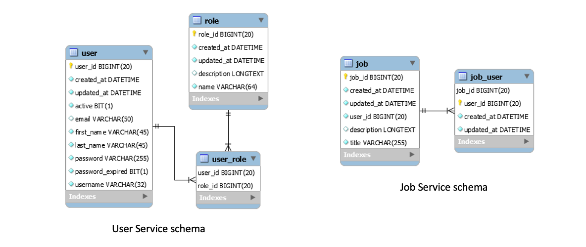

# Step by step development guide
In this section of the repository there is a step-by-step development process showing all the stages of the application development, from the simple microservices to the final dockerized app with decentralized configuration, service discovery and load balancing.

## Table of contents
0. [User and Job microservices](#step-0-user-and-job-microservices)
1. [Add API Gateway and mavenize application](#step-1-add-api-gateway-and-mavenize-application)
2. [Decentralize configuration](#step-2-decentralize-configuration)
3. [Service discovery and Load Balancing](#step-3-service-discovery-and-load-balancing)
4. [Client-side load balancing with OpenFeign](#step-4-client-side-load-balancing-with-openfeign)
5. [Dockerize application](#step-5-dockerize-application)

## Step 0: User and Job microservices
User and Job microservices from step zero are the base services that are extended in the next steps up to reach the final architecture of the microservice-based system.

They can be found in folders ```0-microservices/user``` and ```0-microservices/job```

### System architecture
<p align="center">
  
</p>

### Data Model
<p align="center">
  
</p>

### Deploy and run step 0 microservices

#### User microservice
Download the repository and access the User microservice folder:

```
git clone https://github.com/gianlucafilippone/springboot-microservices-development.git
cd springboot-microservices-development/development/0-microservices/user
```

Compile and run:
```
mvn install
java -jar target/user-0.0.1-SNAPSHOT.jar  
```
or
```
mvn spring-boot:run
```

#### Job microservice
Open a new terminal and access the `0-microservices/job/` folder, then compile and run the Job microservice:
```
mvn install
java -jar target/job-0.0.1-SNAPSHOT.jar  
```
or
```
mvn spring-boot:run
```

> [!NOTE]
> To avoid compiling each system component one by one, from step 1 on there will be a root `pom.xml` file to compile everything together.
> Deployment and run of the next steps is therefore easier.

### Exposed endpoints
- User microservice
    - `[GET, POST, PUT] http://localhost:9044/user`
    - `[GET, DELETE] http://localhost:9044/user/id/{id}`
    - `[GET] http://localhost:9044/user/username/{username}`
    - `[GET] http://localhost:9044/actuator/health`
    - `[GET] http://localhost:9044/actuator/info`
- Job microservice
    - `[GET, POST, PUT] http://localhost:9055/job`
    - `[GET, DELETE] http://localhost:9055/job/{id}`
    - `[GET] http://localhost:9055/job/apply/{username}/{id}`
    - `[GET] http://localhost:9055/actuator/health`
    - `[GET] http://localhost:9055/actuator/info`

## Step 1: Add API Gateway and mavenize application

### System architecture
<p align="center">
  
</p>

### Add an API Gateway
#### Create a new Spring Boot maven project
Create a new Java Maven project. The easiest way is by using the [Spring Initializer](https://start.spring.io): select `Gateway` and `Actuator` as dependencies.

> [!IMPORTANT]
> Check the Spring Boot version if using Spring Initializer: this guide requires Spring Boot 3.1.11 and Spring Cloud 2022.0.2.
> As of May 18, 2024, the support for Spring Boot 3.1.11 ended and Spring Initializer no longer allows the selection of versions previous to 3.2.6.
> Update the pom.xml as below to keep the example working:
> - Set Spring version to 3.1.1 and spring cloud version to 2022.0.2;
> - Add `spring-cloud-starter-gateway` and `spring-cloud-starter-actuator` dependencies;
> - Add the dependency management for Spring Cloud.

The `pom.xml` of the new Gateway project should look like this:

```xml
<?xml version="1.0" encoding="UTF-8"?>
<project xmlns="http://maven.apache.org/POM/4.0.0" xmlns:xsi="http://www.w3.org/2001/XMLSchema-instance"
	xsi:schemaLocation="http://maven.apache.org/POM/4.0.0 https://maven.apache.org/xsd/maven-4.0.0.xsd">
	<modelVersion>4.0.0</modelVersion>
	<parent>
		<groupId>org.springframework.boot</groupId>
		<artifactId>spring-boot-starter-parent</artifactId>
		<version>3.1.11</version>
		<relativePath/>
	</parent>
	<groupId>it.disim.univaq.sose.examples.openjob</groupId>
	<artifactId>gateway</artifactId>
	<version>0.0.1-SNAPSHOT</version>
	<name>gateway</name>
	<description>Openjob API gateway</description>
	<properties>
		<java.version>17</java.version>
		<spring-cloud.version>2022.0.2</spring-cloud.version>
	</properties>
	<dependencies>
		<dependency>
			<groupId>org.springframework.cloud</groupId>
			<artifactId>spring-cloud-starter-gateway</artifactId>
		</dependency>

		<dependency>
			<groupId>
				org.springframework.boot</groupId>
			<artifactId>spring-boot-starter-actuator</artifactId>
		</dependency>

	</dependencies>
	<dependencyManagement>
		<dependencies>
			<dependency>
				<groupId>org.springframework.cloud</groupId>
				<artifactId>spring-cloud-dependencies</artifactId>
				<version>${spring-cloud.version}</version>
				<type>pom</type>
				<scope>import</scope>
			</dependency>
		</dependencies>
	</dependencyManagement>

	<build>
		<plugins>
			<plugin>
				<groupId>org.springframework.boot</groupId>
				<artifactId>spring-boot-maven-plugin</artifactId>
			</plugin>
		</plugins>
	</build>

</project>
```

#### Configure the gateway
Create an `application.yaml` file into the `resource` folder (remove the default generated `application.properties`).

Add the configuration for:
- Server port;
- Gateway routes;
- Actuator.

The resulting `application.yaml` should look like this:

```yaml
# Port of the gateway
server:
  port: 9000
  
# Gateway configuration
spring:
  cloud:
    gateway:
      routes:
        - id: user_route
          uri: http://localhost:9044
          predicates:
          - Path=/api/usr/**
          filters:
          - RewritePath=/api/usr(?<segment>), /user$\{segment}
        - id: job_route
          uri: http://localhost:9055
          predicates:
          - Path=/api/job/**
          filters:
          - RewritePath=/api(?<segment>/?), $\{segment}

# Spring Boot Actuator configuration
management:
  endpoints:
    web:
      exposure:
        include: health,info

# Application info
info:
  application:
    name: Api Gateway
    description: Openjob Api Gateway
    version: 0.0.1-SNAPSHOT
```

#### Exposed endpoints
- `http://localhost:9000/api/usr` routed towards `http://localhost:9044/user`
- `http://localhost:9000/api/job` routed towards `http://localhost:9055/job`
- `[GET] http://localhost:9000/actuator/health`
- `[GET] http://localhost:9000/actuator/info`

### Mavenize application
Add a new `pom.xml` file to the root folder of the project to declare application's modules:

```xml
<?xml version="1.0" encoding="UTF-8"?>
<project xmlns="http://maven.apache.org/POM/4.0.0"
	xmlns:xsi="http://www.w3.org/2001/XMLSchema-instance"
	xsi:schemaLocation="http://maven.apache.org/POM/4.0.0 https://maven.apache.org/xsd/maven-4.0.0.xsd">
	<modelVersion>4.0.0</modelVersion>

	<groupId>it.disim.univaq.sose.examples</groupId>
	<artifactId>openjob</artifactId>
	<version>0.0.1-SNAPSHOT</version>
	<name>openjob</name>
	<packaging>pom</packaging>

	<modules>
		<module>gateway</module>
		<module>job</module>
		<module>user</module>
	</modules>
</project>
```

### Deploy and run step 1 application

> [!NOTE]
> This deployment steps are valid for every development stage hereon.

Download the repository and access this developent step subfolder

```
git clone https://github.com/gianlucafilippone/springboot-microservices-development.git
cd springboot-microservices-development/development/1-gateway+maven
```

Compile all the services:
```
mvn install
```

Run:
```
mvn spring-boot:run -pl [user/job/gateway]
```

## Step 2: Decentralize configuration

### System architecture
<p align="center">
  
</p>

### Create a property files repository
Initialize a new git repository
```
git init openjob-properties-repository
```

Move and rename the configuration files of the services inside the properties repository folder
```
user/src/main/resources/application.properties --> user-microservice-dev.properties
job/src/main/resources/application.properties --> job-microservice-dev.properties
gateway/src/main/resources/application.yml --> api-gateway-dev.yaml
```

Commit to add the file in the repository
```
git add .
git commit -m 'Adding properties files'
```

> [!NOTE]
> The property files repository is available [here](https://github.com/gianlucafilippone/openjob-properties-repository)

### Add a Configuration Server
#### Create a new Spring Boot Maven project
Create a new Java Maven project. The easiest way is by using the [Spring Initializer](https://start.spring.io): select `Config Server` and `Actuator` as dependencies.

> [!IMPORTANT]
> As for the previous step, mind the Spring Boot and Spring Cloud versions: `Spring Boot 3.1.11` and `Spring Cloud 2022.0.2`.

Resulting `pom.xml`:

```xml
<?xml version="1.0" encoding="UTF-8"?>
<project xmlns="http://maven.apache.org/POM/4.0.0" xmlns:xsi="http://www.w3.org/2001/XMLSchema-instance"
	xsi:schemaLocation="http://maven.apache.org/POM/4.0.0 https://maven.apache.org/xsd/maven-4.0.0.xsd">
	<modelVersion>4.0.0</modelVersion>
	<parent>
		<groupId>org.springframework.boot</groupId>
		<artifactId>spring-boot-starter-parent</artifactId>
		<version>3.1.1</version>
		<relativePath/> <!-- lookup parent from repository -->
	</parent>
	<groupId>it.disim.univaq.sose.examples</groupId>
	<artifactId>config-server</artifactId>
	<version>0.0.1-SNAPSHOT</version>
	<name>config-server</name>
	<description>User microservice</description>
	<properties>
		<java.version>17</java.version>
		<spring-cloud.version>2022.0.2</spring-cloud.version>
	</properties>
	<dependencies>
		<dependency>
			<groupId>org.springframework.boot</groupId>
			<artifactId>spring-boot-starter-actuator</artifactId>
		</dependency>
		<dependency>
			<groupId>org.springframework.cloud</groupId>
			<artifactId>spring-cloud-config-server</artifactId>
		</dependency>

		<dependency>
			<groupId>org.springframework.boot</groupId>
			<artifactId>spring-boot-starter-test</artifactId>
			<scope>test</scope>
		</dependency>
	</dependencies>
	<dependencyManagement>
		<dependencies>
			<dependency>
				<groupId>org.springframework.cloud</groupId>
				<artifactId>spring-cloud-dependencies</artifactId>
				<version>${spring-cloud.version}</version>
				<type>pom</type>
				<scope>import</scope>
			</dependency>
		</dependencies>
	</dependencyManagement>

	<build>
		<plugins>
			<plugin>
				<groupId>org.springframework.boot</groupId>
				<artifactId>spring-boot-maven-plugin</artifactId>
			</plugin>
		</plugins>
	</build>

</project>
```

#### Configure the Configuration Server
Edit the `application.properties` file:

```properties
# Port of the service
server.port=8888

# Actuator configuration
management.endpoints.web.exposure.include=health,info
management.info.env.enabled=true

# Application info (to be exposed by /info actuator)
info.application.name=Openjob config server
info.application.description=A server used by microservices for retreiving their configuration
info.application.version=0.0.1-SNAPSHOT

spring.cloud.config.server.git.uri=<PATH-TO-YOUR-GIT-REPOSITORY>
spring.cloud.config.server.git.default-label=master
```

> [!NOTE]
> The `spring.cloud.config.server.git.uri` property must point to the local or remote path of the `openjob-properties-repository`.
> Set the right uri before running the application!

Add the `@EnableConfigServer` annotation to the application class. The class should look like this:
``` java
@EnableConfigServer
@SpringBootApplication
public class ConfigServerApplication {

	public static void main(String[] args) {
		SpringApplication.run(ConfigServerApplication.class, args);
	}
}
```

#### Add a new module to the maven project
Update the project's root `pom.xml` to add the configuration server as one of the modules.
```xml
	<modules>
		<module>config-server</module>
		<module>gateway</module>
		<module>job</module>
		<module>user</module>
	</modules>
```

#### Exposed endpoints
- `[GET] http://localhost:8888/user-microservice/dev`
- `[GET] http://localhost:8888/job-microservice/dev`
- `[GET] http://localhost:8888/api-gateway/dev`


### Update User, Job and Gateway services
> [!NOTE]
> This steps are the same for each of the three components.

#### Add dependencies for Spring Cloud Config Client
Update the `pom.xml` by adding the dependency management for Spring Cloud and the dependency to `spring-cloud-config-client`:

```xml
	...
	<properties>
		<java.version>17</java.version>
		<spring-cloud.version>2022.0.2</spring-cloud.version>
	</properties>
	
	<dependencyManagement>
		<dependencies>
			<dependency>
				<groupId>org.springframework.cloud</groupId>
				<artifactId>spring-cloud-dependencies</artifactId>
				<version>${spring-cloud.version}</version>
				<type>pom</type>
				<scope>import</scope>
			</dependency>
		</dependencies>
	</dependencyManagement>
	
	<dependencies>
		...
		<dependency>
			<groupId>org.springframework.cloud</groupId>
			<artifactId>spring-cloud-starter-config</artifactId>
		</dependency>
		...
	</dependencies>
```

> [!NOTE]
> The Gateway's `pom.xml` already has the dependency mangament for Spring Cloud.

#### Update property files
Remove the old `application.properties` or `application.yaml` file and subsitute with a new `application.properties` as follows:
```properties
spring.application.name=[job-microservice/user-microservice/api-gateway]
spring.profiles.active=dev
spring.config.import=optional:configserver:http://localhost:8888
``` 

> [!IMPORTANT]
> The `spring.application.name` and `spring.profiles.active` properties must match with the name of the property file we put in the property files repository.
> E.g., the name `job-microservice` and the active profile `dev` must match with the property file `job-microservice-dev.properties` file.

Now, when starting one of these three components, its configuration will be asked to the configuration server.

> [!NOTE]
> The configuration server should be up and running before starting the services.

### Configure dynamic properties refresh
Update the services' properties (from the configuration files within the property files repository) and add `refresh` to the `management.endpoints.web.exposure.include` property.

The property file should contain these lines:
```properties
# Actuator configuration
management.endpoints.web.exposure.include=health,info,refresh
management.info.env.enabled=true
```

For the gateway, there should be this:
```yaml
management:
  endpoints:
    web:
      exposure:
        include: health,info,refresh
```

Add the `@RefreshScope` annotation to each Bean reading properties from the configuration file, e.g., the `UserMicroserviceInvoker` class.

```java
@Component
@RefreshScope
public class UserMicroserviceInvoker {
	...

	@Value("${microservice.user.find.uri}")
	private String baseUri;
	...
}
```

> [!NOTE]
> Always commit changes into the property files repository to make them available to the configuration server.

#### Test the dynamic reconfiguration
1. Update the `server.port` property in the `user-microservice-dev.properties` file to a different port (e.g., `9045`)
2. Commit changes and start all the services
3. Test the endpoints `[GET] http://localhost:9000/api/usr` and `[GET] http://localhost:9000/api/job/apply/applicant/2`: an error from both the Api Gateway and Job microservice occurs.
4. Update the job microservice property `microservice.user.find.uri` and the api gateway route configuration with the new user microservice port
5. Commit changes
6. Without restarting services, send an empty `POST` request to both `http://localhost:9055/actuator/refresh` (i.e., job microservice actuator refresh endpoint) and `http://localhost:9000/actuator/refresh` (i.e., gateway actuator refresh endpoint). The services will automatically update their configuration.
7. Run again step 3.


## Step 3: Service discovery and Load Balancing
To be done

## Step 4: Client-side load balancing with OpenFeign
To be done

## Step 5: Dockerize application
To be done
